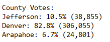
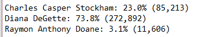

# Election-Analysis

## Project Overview

The [Election Analysis](PyPoll_Challenge.py) will utilize the Python Programing to analyze a set of voters in the recent Congressional election for a precinct in Colorado. The data set consist of 369,711 total voters from the Arapahoe, Denver, and Jefferson County. Votes are identified by Ballot ID and the voting County. In this election there were 3 candidates in the running.

### Purpose

Working with Seth and Tom, we will create a program that can receive a simple csv table of all votes cast and summarize the Election results for the election commission. The main goal of this program is to track voter turnout and find the winner. The data we will report is as follows.

-	How many votes took place in each county.
-	Which county saw the greatest number of voters.
-	How many votes each candidate received.
-	The winner of the Election.

## Analysis

### Methodology

To complete this analysis and make a program that is easily transferable we will utilize python and its base libraries. The 1st step for this analysis will be loading up the data we want to run the analysis run. For this dataset we will use the built in CSV library to read in the [election_results.csv](Resources/election_results.csv) provided by the election committee. Once the data gets loaded in as a list, we make a For Loop to read through all the rows. Inside the loop we will count the number of rows and read the voters candidate choice and county. If the county or candidate is new, then we make a new entry in a list. Votes are then tallied by candidate choice and county.
	
To compile the results, we create two separate For Loops, one loop cycles through counties and the other cycles through the candidates. With these loops we will output and save the Votes for each candidate and county. Using `if (votes > winning_count) and (vote_percentage > winning_percentage):` We record the largest vote value and what they belonged to. After all candidates and counties have been checked we output the winner for the election committee to review.

## Results

The election committee asked us to review county data and find out where voters are the most active. Since this list only contains votes cast, we will look at the county make up out of everyone who voted in the election. Looking at the results above we can see that Denver had the largest number of participants by far. Denver held 82.8% of the vote. Reasons behind this may be due to Denver’s status as a major metro area and the states capital. Arapahoe, while not too far behind Jefferson, had the least amount of votes. Since Arapahoe is the 3rd most populated country while Jefferson is the 4th this could be a sign that there was low voter turnout. this data shows that was the clear winner of the voter turnout.

-	Denver was the winning county for the vote
-	Arapahoe only had 6.7% of the vote

For the candidate results shown above. While there is a clear winner the votes were a little more spread out than the county votes. Diana DeGette caried the election with 73.8% of the vote. This puts her well above the majority needed to win. Charles Casper Stockham trailed far behind with 23% of the vote. Raymon Anthony Doane fell far behind with only 3.1% of the vote. These results show that Diana DeGette won the election.

-	Diana Degette got majority vote and is thus the winner.

### Summary

The Election committee asked us to make a program that they could use to easily summarize future votes. While this program is set up for this specific CSV it shouldn’t be hard to make it more dynamic in the future. Currently we specify `Row[1]` for county and `Row[2]` for candidate. The program only works if the second column contains the county and the 3rd column contains the Candidate. While this works, it would be annoying to ensure election results are in that order. How I would fix that is by using `Header_index = Header.Index(“desired header”)`. This will give us one for “County” and 2 for “Candidate”. If those 2 end up in a different position the program would know. Along with this change the second change I would make is to make a list of headers to run at the start of the program. You could even request the user to input the headers and store them in the list. Along with this change you would want to alter the parts of the code where county and candidate are currently referenced. Wrap each section in a `For Item in header_index:` then use a Dictionary of list to store the results. With these changes the program should be able to handle any CSV the election committee wants to use.
